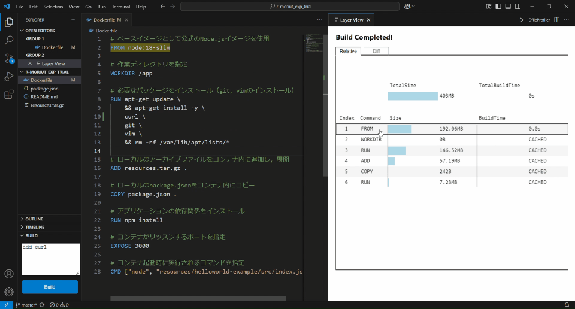

# DfileProfiler

    

    <strong>DfileProfiler is a Visual Studio Code extension designed to analyze and visualize Docker image builds.</strong> 
    This tool provides insights into the size and build time for each layer, and changes across different builds.

## Requirements
- Windows 10 or later
- macOS 10.15 or later
- Visual Studio Code 1.97 or later
- Docker: Must be installed and running

## Features

### Build and Analyze Docker Images
1. Start Docker.
1. Open VSCode and navigate to `File → Open Folder...` to open your Docker project directory.
1. Open the Dockerfile and click the `DfileProfiler` button to activate the extension. A sidebar will appear with a text area and the `Build` button.
1. You can enter comments in the text area (similar to Git commit messages) to document changes for the build (optional).
1. Click the `Build` button to start the image build process.
1. Once the build is complete, an analysis view (Layer View) will be displayed. The generated image will be named `myimage`.

### Layer View
The visualization panel allows switching between different views:

- Relative View: Displays each layer's size and build time as a percentage of the total.
- Diff View: Displays differences in size and build time between the latest build and a selected previous build.

If multiple builds exist, a pagination system allows selecting builds for comparison.

### Mapping Layers to Dockerfile
Hovering over a layer in Layer View highlights the corresponding lines in the Dockerfile.

Clicking on a layer navigates to the corresponding lines in the Dockerfile.

### Rebuild Notification for Affected Layers
If the Dockerfile or an external dependency file is modified, an icon appears indicating which layers require rebuilding due to build cache invalidation.

## Release Notes

### 1.0.0
Initial release with features presented in [the IEICE technical report](https://ken.ieice.org/ken/paper/20250113FchM/).

### 1.1.0
Added the feature to select builds for comparison and to input comments at build time.

## Future Enhancements
- Performance improvements in rendering.
- Functionality to estimate the cause of Dockerfile smells and suggest fixes.